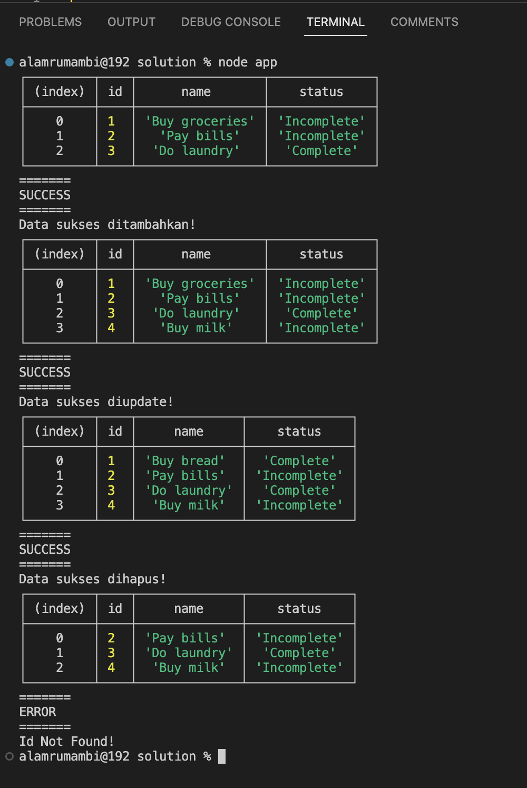

## MVC, JSON, fs (sync)

Di latihan kali ini, kita akan membuat sebuah aplikasi untuk mengelola daftar to-do yang disimpan dalam sebuah file JSON. Aplikasi ini akan memungkinkan pengguna untuk menambah, menghapus, mengupdate, dan menampilkan to-do item.

1. Buat file `task.js` yang akan berisi model untuk membuat instances to-do item:

```js
class Task {
  constructor(id, name, status) {
    this.id = id;
    this.name = name;
    this.status = status;
  }
}

module.exports = Task;
```

2. Buat file `taskModel.js` yang akan berisi logika untuk mengelola daftar to-do item:

```js
const fs = require("fs");
const Task = require("./task");

class TaskModel {
  static getTasks() {
    // proses untuk membaca daftar to-do item dari file.json
  }

  static saveTasks(file) {
    // proses untuk menyimpan perubahan to-do item ke file tasks.json
  }

  static addTask(task) {
    // proses untuk menambahkan data baru ke to-do item
  }

  static deleteTask(id) {
    // proses untuk menghapus sebuah data dari to-do item

  }

  static updateTask(id, name, status) {
    // proses untuk mengubah salah satu data baru dari to-do item
  }

  static getTask(id) {
    // proses untuk menampilkan salah satu data dari to-do item berdasarkan id
  }
}

module.exports = TaskModel;
```

3. Buat file `taskView.js` yang akan berisi logika untuk menampilkan to-do item ke dalam antarmuka pengguna:

```js
class TaskView {
    static showData(tasks) {
        // untuk menampilkan data dalam bentuk tabel
    }

    static showMessage(msg) {
        // menampilkan pesan hasil sukses pengolahan data
    }

    static showError(msg) {
        // menampilkan pesan error dari proses pengolahan data
    }
}

module.exports = TaskView;
```

4. Buat file `taskController.js` yang akan menghubungkan model, view, dan logic untuk mengelola daftar to-do item:

```js
const TaskModel = require("./taskModel");
const TaskView = require("./taskView");

class TaskController {
  static addTask(name) {
    // menambahkan 1 data baru ke to-do item dan menampilkan respon pesan berhasil/gagal menambahkan data
  }

  static deleteTask(id) {
    // menghapus 1 data dari to-do item dan menampilkan respon pesan berhasil/gagal menghapus data
  }

  static updateTask(id, name, status) {
    // mengubah 1 data dari to-do item dan menampilkan respon pesan berhasil/gagal mengubah data
  }

  static getTask(id) {
    // mengambil salah 1 data to-do item berdasarkan id dan menampilkan datanya
  }

  static getTasks() {
    // mengambil semua data to-do item dan menampilkan datanya
  }
}

module.exports = TaskController;
```

5. Buat file `app.js` yang akan memuat modul-modul yang diperlukan dan melakukan inisialisasi aplikasi:

```js
const TaskController = require("./TaskController");

// get all tasks
TaskController.getTasks();

// add a task
TaskController.addTask("Buy milk");

// get all tasks
TaskController.getTasks();

// update a task
TaskController.updateTask(1, "Buy bread", "Complete");

// get all tasks
TaskController.getTasks();

// delete a task
TaskController.deleteTask(1);

// get all tasks
TaskController.getTasks();

// get a task
TaskController.getTask(1);
```

6. Jalankan aplikasi dengan perintah `node app.js`.
Pada saat pertama kali dijalankan, aplikasi akan mencoba membaca file `tasks.json`. Jika file tersebut tidak ada atau terdapat error dalam membacanya, maka aplikasi akan menganggap tidak ada task yang tersimpan. Kemudian, kita melakukan beberapa operasi CRUD pada daftar to-do item dan menampilkan hasilnya menggunakan `TaskView`.

Ekspektasi output dari aplikasi ini adalah seperti gambar di bawah ini

